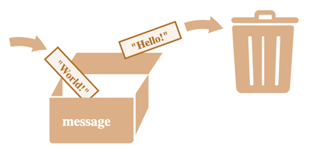

# Вывод содержимого переменной

Переменные в Python используются для хранения данных, которые могут изменяться в ходе выполнения программы.  

Переменную можно представить как коробку, в который кладутся данные.

Надпись на коробке — это название переменной, с которой нам как пользователю удобно работать.  
А сама коробка, это реализация переменных внутри Python.

Переменные позволяют программистам оперировать с данными в программе, например, в переменную можно что-то положить, можно посмотреть, что в ней лежит.  
А можно просто заменить содержимое переменной.

## Задание: 
1. С помощью команды `print()` распечатайте новое значение переменной `message`.