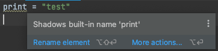

# Как нежелательно называть переменные

В Python есть множество встроенных функций, которые доступны в любом Python интерпретаторе.  
Некоторые из наиболее часто используемых встроенных функций в Python включают:
- `print()`: выводит значения на экран;
- `len()`: возвращает длину объекта (количество элементов в списке, строке, кортеже и т.д.);
- `input()`: позволяет пользователю вводить значения в программу;
- `max()` и `min()`: возвращает наибольшее или наименьшее значение из последовательности чисел;

> **Примечание:** C полным перечнем встроенных функций можно ознакомиться в **[официальной документации](https://docs.python.org/3/library/functions.html#built-in-functions)**.

Использовать их в качестве переменных можно, но не желательно.  
Такими действиями вы перезапишите стандартное поведение встроенных функций и не сможете пользоваться ими до конца выполнения текущей программы.  

После перезапуска программы, они будут доступны снова до того момента, пока они не будут перезаписаны.  

```python
print = "test"  # ошибки нет, но есть предупреждение
```


## Задание:
1. Верните работоспособность коду, чтобы он прошел проверку.

<div class="hint">
    Изменить название переменной print. Например, добавив нижнее подчеркивание в конце переменной.
</div>

