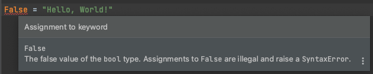

# Как нельзя называть переменные

Есть перечень зарезервированных слов, которые нельзя использовать в качестве названия переменных.
Чтобы получить перечень этих слов можно вызвать команду:
```python
help("keywords")  # перечень зарезервированных слов
```
Эти ключевые слова запоминать не нужно, среды разработки выделяют такие слова отдельным цветом.

Если назвать переменную как ключевое слово, то будет ошибка  
```python
# Если попытаетесь назвать переменную ключевым словом получите ошибку
False = "Hello, World!"  # SyntaxError: can't assign to keyword
```


Но если очень хочется, то чуть-чуть можно...  
```python
# принято в конце дописывать нижнее подчеркивание, если название переменной совпадает с ключевым словом
False_ = "Hello, World!"  # корректное объявление переменной
```
> **Примечание:** По соглашению в PEP8 для избежания конфликтов с ключевыми словами языка python принято дописывать к ним нижнее подчеркивание в конце названия переменной.

## Задание:
1. Добавьте символ нижнего подчеркивания после ключевого слова `False`, чтобы его можно было использовать в качестве названия переменной.
