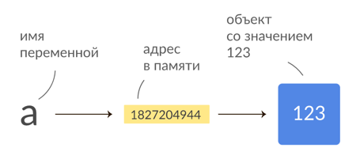
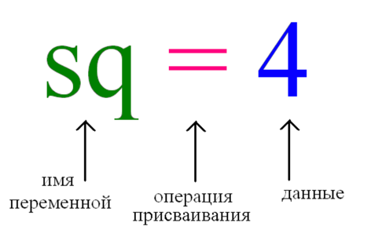

# Переменные в Python

**Переменная** - это именованная область памяти компьютера,
адрес которой позволяет получить доступ к данным.

Оператор присваивания `=` (знак равно) в Python используется для присваивания значения переменной. 

> **Примечание:** По рекомендациям PEP8 перед и после знака равно (" = ") следует оставлять один пробел.

## Задание:
1. Создайте переменную `some_variable` и присвойте ей значение "Hello, World!".
