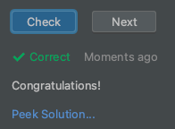

# Возможное решение задания

Вне зависимости от результата проверки задания, можно получить решение (если само задание содержит решение).  
Для того, чтобы посмотреть решение задания, необходимо нажать на надпись **Peek Solution**.  

Старайтесь не жульничать, и подглядывать в решение только в случае, если вы решили задание.  
Но если долго не получается решить задание даже с использованием подсказок, всегда можно обратиться к решению.

Решение представленное автором не является истинной в последней инстанции.  
Если оно отличается от вашего, и все проверки пройдены, это не значит, что вы решили неправильно.  

Возьмите паузу и изучите решение автора (да-да читать чужой код куда сложнее, чем писать свой).  
В авторском решении могут содержаться хорошие практики или какие-то новые и не известные вам способы решения.
> Когда у тебя в руках есть только молоток, тогда все вокруг превращается в гвозди.

## Задание:
1. Распечатайте два слова Hello и World на отдельных строках.
2. Запустите проверку задания.
3. Нажмите на надпись **Peek Solution**, чтобы посмотреть решение.  
   Там иногда можно узнать что-нибудь новое.
