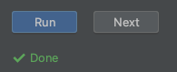
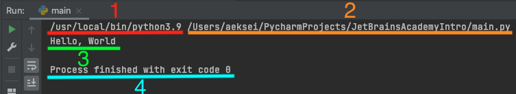

# Задание без проверки
Первый тип заданий — это задания без проверки.  

Задания без проверки включают в себя кнопку "Run" для запуска задания.  
  
Такие задания считаются автоматически верными.  

Нажав на кнопку "Run" интерпретатор python выполнит весь исходных код, который находится в файле `main.py`.  
Программу на языке python ещё называют скриптом.

В среде разработки PyCharm после выполнения программы открывается отдельное окно "Run", в котором будет выведен результат выполнения программы.
  
1. Путь до интерпретатора, который выполнял python программу.
2. Путь до файла с python программой.
3. Результат выполнения программы. Сюда выводятся результаты команды `print` или ошибки возникшие при запуске.
4. Статус код выполнения программы. Код 0 означает, что при запуске не возникло никаких ошибок.

## Задание:
Ни одно знакомство с языком не обходится без первой [программы](https://ru.wikipedia.org/wiki/Hello,_world!#:~:text=%C2%ABHello%2C%20world!%C2%BB%20%E2%80%94,%C2%AB%D0%B2%D1%81%D0%B5%D0%BC%20%D0%BF%D1%80%D0%B8%D0%B2%D0%B5%D1%82!%C2%BB) "Hello World".
1. Нажмите Run, чтобы запустить задание.
2. Проверьте, что строка "Hello, World" была распечатана.
3. Нажмите Next, чтобы перейти к следующему заданию.
