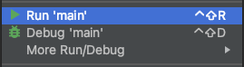

# Задание с выбором ответа

Задание с выбором ответа это ещё один тип заданий.  
Здесь вам из преложенных вариантов необходимо выбрать верный ответ.  
Задания бывают с единственно верным ответом или множественным выбором (будьте внимательны задания с множественным выбором могут содержать только один правильный ответ).

Если в задании с выбором ответа, нажать "Check", то код из `main.py` не запустится.  
Чтобы запустить его первый раз, нужно нажать правым кликом в области с кодом и выбрать пункт "Run".  


Дальше можно запускать код, нажав зеленый треугольник в правом вернем углу.


## Задание:
Стандарт PEP8 [рекомендует](https://pythonworld.ru/osnovy/pep-8-rukovodstvo-po-napisaniyu-koda-na-python.html#section-4) использовать четыре пробела для каждого уровня отступа в Python.  
Это позволяет легко читать код и облегчает согласование стиля программирования в команде.

1. Вам предложено 3 варианта кода, скопируйте и запустите каждый. Найдите тот вариант, в котором допущена ошибка `IndentationError`.

### Вариант 1:
```python
def main():
 print("Hello")
 print("World")
```

### Вариант 2
```python
def main():
   print("Hello")
   print("World")
```

### Вариант 3
```python
def main():
   print("Hello")
    print("World")
```
