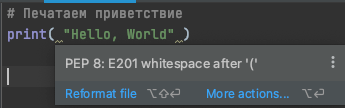

# Задание с множественным выбором

PEP - это сокращение от "Python Enhancement Proposal" (предложение по улучшению Python).  
PEP представляет собой формализованный процесс, который позволяет разработчикам Python предлагать новые идеи и изменения в язык Python.


PEP - это документ, который описывает новые функции, улучшения, изменения или общие рекомендации для языка Python.
Вот три из самых важных PEP:
1. **PEP 8** - это руководство по написанию кода на языке Python. 
    Он описывает правила и рекомендации по стилю кодирования, включая именование переменных, отступы, длину строк, комментарии и т.д.  
    PEP 8 помогает разработчикам создавать более читаемый и поддерживаемый код.
2. **PEP 20** - это набор принципов, известных как "The Zen of Python" (Философия Python).  
    Он содержит 19 кратких принципов, которые описывают философию языка Python.  
    PEP 20 определяет ценности и приоритеты в разработке на Python, помогая разработчикам создавать более эффективный и понятный код.
3. **PEP 257** - это рекомендации по документированию кода на языке Python.  
    PEP 257 описывает стандарты и рекомендации для написания документации, такие как форматирование строк документации, использование резюме функций и описания параметров, возвращаемых значений и исключений.  
    Хорошо написанная документация помогает другим разработчикам лучше понимать ваш код и использовать его в своих проектах.
   
## Задание:
1. Прочтите [PEP8](https://pythonworld.ru/osnovy/pep-8-rukovodstvo-po-napisaniyu-koda-na-python.html).  
    Учить его не нужно, периодически возвращайтесь к нему, чтобы освежить в память хорошие практики написания python кода.
2. В среде разработки PyCharm есть встроенный форматер кода, отвечающий рекомендациям стандарта PEP 8 для Python.  
    Когда происходит несоответствие кода стилю PEP8, среда разработки подчеркивает их серым цветом.  
    
3. Скопируйте и запустите код. Убедитесь, что предупреждения никак не влияют на работоспособность кода, ведь PEP8 это рекомендации.
   ```python
    # TODO исправить все не соответствия стандарту PEP8
    
    # Печатаем приветствие
    print( "Hello, World" )
    
    
    
    print("Конкатенация строк" + " - это процесс объединения двух или более строк в одну строку")
    print(1+ 2)  # складываем два числа
    
    print()
    ```

4. Найдите все не соответствия стандарту PEP8 в представленном коде и попробуйте исправить их.

<div class="hint">
  Избегайте использования пробелов в внутри круглых, квадратных или фигурных скобок.
</div>

<div class="hint">
  Всегда окружайте операторы одним пробелом с каждой стороны.
</div>

<div class="hint">
  Пустые строки возможно использовать для разделения различных групп похожих функций и улучшения читаемости кода.
</div>

<div class="hint">
  Согласно PEP8, на конце каждого файла должна быть пустая строка. Это требование не относится непосредственно к стилю кодирования, но является рекомендацией для удобства обработки текстовых файлов.
</div>


