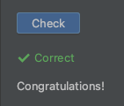

# Задание с проверкой по распечатанной информации
Второй тип заданий — это задания с проверкой по распечатанной информации. 

Задания с проверкой по распечатанной информации включают в себя кнопку "Check" для запуска задания.  

Задания такого типа должны содержать в себе команду `print()`, которая будет печатать результат выполнения вашего задания.  
Результат должен в точности совпадать с ожидаемым результатом.  

Если ответ совпадает, то увидите зеленую запись _Correct_.

## Задание:
1. Запустите проверку задания, нажав кнопку "Check".
2. Нажмите на вкладку "Run", в левом нижнем углу, чтобы убедитесь, что фраза Hello, World была распечатана.
