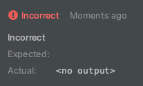

# Отсутствие результата с проверкой по распечатанной информации

Иногда при проверке задания, можно увидеть фразу: ```<no output>```.


Появляется она в двух случаях:
1. Не вызвана команда `print`, чтобы распечатать результат.
2. В написанной программе находится ошибка, и интерпретатор не смог выполнить код.

> Примечание: В этих случаях надо открыть вкладку Run, и разбираться в чём ошибка.

## Задание:

1. Запустите проверку задания. 
2. Затем откройте вкладку Run в левом нижнем углу, чтобы увидеть результат вашей программы.  
   А есть быть точнее, то его отсутствие.
3. Распечатайте строку "Hello, World" с помощью команды `print()`.

<div class="hint">
  Как распечатать строку Hello, World можете подсмотреть в прошлых заданиях. Не стесняйтесь смотреть решения в прошлых заданиях.
</div>
