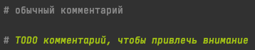
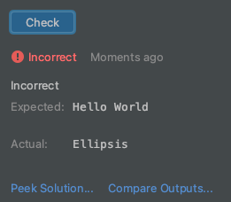
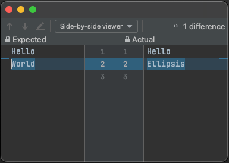

# Расхождение ожидаемого результата

В Python `инструкция` (statement) - это фрагмент кода, который выполняет определенную операцию.  
Инструкции в Python выполняются последовательно, поэтому порядок, в котором они написаны, имеет значение.  

> **Примечание:** Принято каждую отдельную инструкцию писать на отдельной строке

В Python комментарии — это текст внутри исходного кода, который игнорируется интерпретатором Python при выполнении программы.  
Комментарии полезны для пояснения кода и делают его более понятным для других разработчиков.

В Python есть два способа написания комментариев:
1. Однострочные комментарии начинаются с символа `#` и продолжаются до конца строки. 
2. Многострочные комментарии заключаются в тройные кавычки и могут занимать сразу несколько строк.

## Задание:
1. Запустить первоначальный вариант задания.  
    Если задание не прошло проверку, то будет красная запись _Incorrect_.

    Те места, которые нужно выполнить в задании, выделены [особыми](https://ru.hexlet.io/blog/posts/kak-pravilno-pisat-kommentarii) комментариями, начинающимися, например, с *TODO*.  
    > **Примечание:** Особенность среды разработки PyCharm, что такие комментарии выделяются особенно для привлечения внимания.  
    

2. Нажать **Compare Outputs**, чтобы сравнить ответы.  
    Если задание не прошло проверку, то нажав на надпись **Compare Outputs**, 
    можно сравнить ваше решение и ожидаемый ответ.  
      

    > **Примечание:** Слева будет представлен ожидаемый результат (expected), справа (actual) — результат выполнения вашего кода.  
    

3. Исправить код, чтобы задание было выполнено верно.
